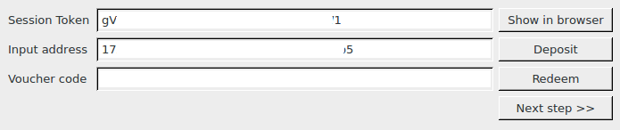
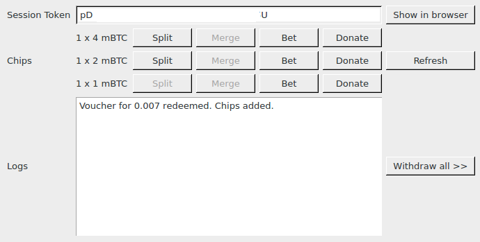
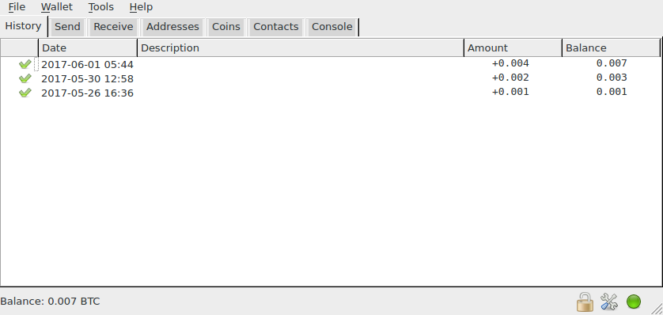

# ChipMixer plugin for Electrum

Using our plugin you can tumble your bitcoins witout leaving your wallet.

## Usage

Before you use it, you have to enable our plugin:

1. Click `Tools` -> `Plugins`.
2. Enable 'ChipMixer tumbler'.

Tumble your bitcoins:

1. Click `Tools` -> `Tumble with ChipMixer`
2. Click `Deposit`. Set amount to send.
3. Click `Next step`.
4. If your transaction is not yet confirmed, you will have to click `Refresh`.
5. `Split` / `Merge` / `Bet` / `Donate` as much as you want.
6. Click `Withdraw all` and name your new wallet. It contains all your chips
  and both wallet's funds are not linked with each other.

## Screenshots

Step 1: Deposit of funds

Step 2: Splitting and merging chips

Step 3: New wallet funded with chips
